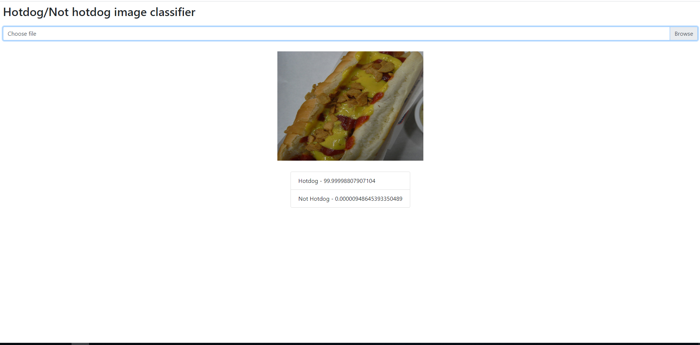

# Hotdog / **!** Hotdog image classification with CNN, using Keras model

### Introduction

This project is the basis of the article entitled "Hotdog / Hotdog image classification with CNN, using Keras model",
which can be read in full in the blog section of the Codexworks team: www.codexworks.com.

### Overview

In order to start training process or see how the training was done for this classification problem, 
check **cnn_train.py** from modelling package. CNN's architecture is defined in **MainCNNRecognition** class, 
and the corresponding interface can be found in **CNNInterface.py**.

### Web platform

In order to use the created keras classifier, we created a web platform using Angular, through which an image can be uploaded and classified. The classification operation is performed at the client level, the keras model being deployed through the libraries offered by **TensorFlow.js**: https://www.tensorflow.org/js. 

